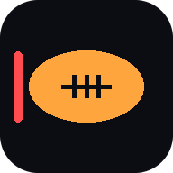
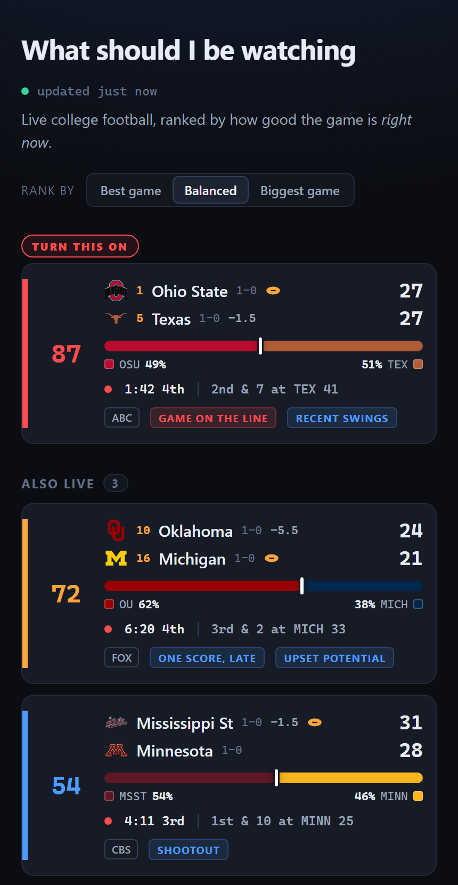
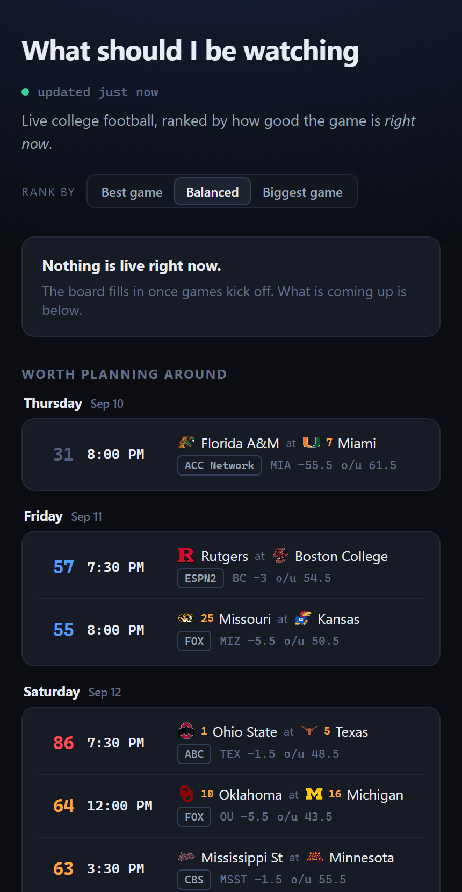

#  Football: What Should I Be Watching

A live board that answers one question: **which football game should I have on right now?**

Rankings and records tell you which games *matter*. They do not tell you which game is
currently a one-score fight with four minutes left. This polls the public ESPN scoreboard and
ranks every in-progress game by how good it is at this moment, then ranks the week ahead by how
much each matchup is worth planning around.

Covers the **NFL** and **college football**, on separate tabs with separately calibrated
models, because a 45-38 college shootout and a 27-24 NFL game are not the same event.

No API key, no account, no database.

| What is on right now | What to plan around |
| --- | --- |
|  |  |

<sub>Real teams, lines and networks. In-game scores and clocks are illustrative.</sub>

## What the board shows

**Live games**, best first. Each card carries the score, live win probability, the clock and
situation, who has the ball, the network, the pregame line, and any tags that apply:
`GAME ON THE LINE`, `UPSET ALERT`, `RECENT SWINGS`, `INSTANT CLASSIC`, `OVERTIME`.

**Worth planning around**, grouped by day with days in chronological order and games ranked
within each day, so you plan Friday before you plan Saturday. Each row shows kickoff time, the
line, the over/under and the network.

**Just finished**, the recent recap, best first.

**League tabs** switch between NFL and college. The NFL opens by default. Your tab, favourite
conferences and postal code all persist in the browser.

**Favourite conferences** push the games you care about up the board. Tick AFC, or the SEC, and
matchups involving those get a bonus applied client side, so it reorders instantly.

## How the score works

Every live game gets a 0-100 score, and the board sorts on it.

**The main term is how close the game is, weighted by how late it is.** A tie in
the first quarter is not the same event as a tie with ninety seconds left, so
closeness is multiplied by `0.2 + 0.8 * progress²`. Closeness itself comes from
ESPN's live win probability, falling back to a margin curve when ESPN stops
publishing one.

**A second term catches what win probability misses.** A team down five with the
ball and thirty seconds left has a terrible win probability and is the most
watchable thing on television. So one-score games inside the final five minutes
get a `clutch` score, weighted up when the *trailing* team has the ball. The
dominant term is whichever of the two is higher, so a game qualifies on either.

Four smaller components adjust it:

| Component | What it measures |
| --- | --- |
| `prominence` | How much of the country cares. Conference tier, best rank, and broadcast slot |
| `upset` | How far the underdog is running ahead of the pregame closing line |
| `swing` | Cumulative win-probability movement over the last fifteen minutes |
| `stakes` | Both teams ranked, both top-10, conference game |
| `pace` | Projected total points, so a 45-38 track meet beats a 10-7 slog |

`prominence` deliberately takes the **better** of the two programs. One blue blood
is enough to put a game in the national conversation, which is why a ranked team
struggling against a MAC opponent is a bigger story than an excellent Sun Belt
game. Broadcast slot feeds into it because networks allocate their best inventory
to the games they expect to draw, so ABC and NBC rate far above ESPN+.

### Where the two leagues differ

The components are the same; what feeds them is not.

| Component | College | NFL |
| --- | --- | --- |
| `prominence` | Conference tier, best AP rank, broadcast slot | Best record, best playoff seed, kickoff slot |
| `upset` | Closing line, with the rank gap as fallback | Closing line, with the record gap as fallback |
| `stakes` | Both ranked, both top-10, conference game | Division game, both contenders, both winning |
| `pace` | Scaled around a 55-point typical total | Scaled around a 45-point typical total |

There are no AP rankings in the NFL and no conference tiers worth speaking of, so prominence is
rebuilt from the standings feed: record quality, playoff seeding, and the kickoff slot. Slot
carries real weight there because every NFL network is a major one, so a Sunday night game is a
deliberate statement about the matchup in a way that "it is on ESPN" is not in college.

`pace` is calibrated per league for a reason worth recording. Scaled for college, an NFL game
could never exceed 0.38 on that term, because NFL over/unders run roughly 46 against college's
53. That flattened the whole NFL board and kept it from ever crossing the `TURN THIS ON`
threshold until it was fixed.

`upset` uses the **pregame closing line**, not the ranking gap. Rank cannot tell a
27-point mismatch from a coin flip, and both can look like "ranked versus
unranked". A live line is no good either, because it moves with the game and prices
the surprise away. The ranking gap survives at 60% strength as a fallback, so an
unranked team beating a ranked one still registers.

### One weighting, not a dial

An earlier version shipped three selectable profiles, trading closeness against
prominence. Measured against a full Saturday of finished games, the top-ranked game
was **identical under all three**, nothing moved more than two positions, and what
movement there was happened at positions nine through twelve. It also never applied
to the upcoming list at all. A control that cannot change the answer is not a
control, so the weights are now fixed and tuned directly:

| Component | Weight |
| --- | --- |
| `primary` (closeness, weighted by how late) | 0.58 |
| `prominence` | 0.18 |
| `swing` | 0.08 |
| `upset` | 0.07 |
| `stakes` | 0.05 |
| `pace` | 0.04 |

They sum to 1, so a total is always 0-100. A game with a 25-point margin past the
80% mark is capped at 8 regardless of what the other terms think.

### Before kickoff

Upcoming games get a separate `anticipation` rating driven mostly by the spread,
since nothing we compute beats the market at predicting a close game. Note the
asymmetry with the live score: pregame quality takes the **worse** of the two
teams, because planning an evening around a mismatch is a bad idea however good the
favourite is.

### What a number actually means

The two leagues have different shapes, so read each tab against itself. A typical week:

```
NFL  n=15   top 75.2   median 64.8   low 47.1
CFB  n=60   top 87.8   median 45.4   low 38.4
```

College is bimodal: two genuinely great games, a cliff, then 46 of 60 below 55. The NFL is flat,
with 12 of 15 packed between 55 and 75. A 30-team league with a salary cap produces uniformly
competitive matchups; a 130-team league produces a few marquee games and a lot of filler.

| Pregame | Reads as |
| --- | --- |
| 80+ | Rare. Two good teams, tight line, big slot |
| 70-79 | Clear the evening. The top of a typical NFL slate |
| 55-69 | Worth having on. Where most NFL games live |
| under 55 | Background noise |

Pregame `anticipation` and the live score are **different scales**. Anticipation is deliberately
conservative and takes the *worse* of the two teams. Live scores run higher because
closeness-and-lateness dominates, which is why `TURN THIS ON` fires at 75 live. A 70 pregame can
become a 90 once it kicks off.

## Can I actually watch it

A great game you cannot get is not a recommendation. On Sunday afternoons the networks split the
slate by market: eight games kick at 1:00, but only one CBS and one FOX game reaches any given
city.

ESPN cannot answer this. It labels every NFL game `National`, including the eight that are
plainly regional, and the published coverage maps sit behind a bot wall. So the board works it
out in two layers.

**Without a postal code**, regionality is derived from the slate itself. A network can only air
one game per window in any one market, so whenever CBS or FOX carries several games in the same
kickoff window, those games are by definition being divided up. That fact is worth saying exactly
once, as a single prompt to set a postal code, and it is not worth a badge on every row: with no
market set, every 1:00 game is equally regional, which is noise rather than a signal. College is
deliberately excluded from the inference: fifteen concurrent games under "ESPN+" are fifteen
separate streams, not a market split, and the same count would lie.

**With a postal code**, the board reads the public Gracenote listings grid and reports which
game your own affiliates are carrying, as `on WBZ, WPRI` or `not on your channels`. Games your
market is not showing keep their real score, because the score says how good the game is, but
they fade back and sort below the ones you can get. An absence is not a warning, so it is drawn
quietly rather than in a colour that competes with the scores.

**Usually you do not have to type one.** Behind Cloudflare, switching on the managed transform
*Add visitor location headers* makes every request carry `CF-Postal-Code`, and the board uses it
as the default market. An explicitly entered postal code always wins, because IP geolocation
reliably lands in the right metro but not always the right one of two neighbouring markets.

Trusting that header is safe because it is per request: forging one only changes the listings in
your own response, which you could do by typing a different postal code anyway.

The market control has three states, because "work it out for me" and "do not filter at all" are
different requests: a postal code you typed, the detected one, and explicitly off. **Clear** turns
it off entirely rather than falling back to detection, and **Redetect** goes back to the network's
answer without making you retype anything.

With no postal code from any source, nothing is flagged at all. Every 1:00 game is then
equally uncertain, and a badge on four-fifths of the board is wallpaper rather than a signal, so
the board says it once as a dot on the market control and otherwise stays out of the way.

An explicit postal code lives in the browser, not on the server, so the same board serves someone
in Boston and someone in Dallas correctly.

Fuller reasoning, and the games that forced each of these decisions, are in
[docs/design-notes.md](docs/design-notes.md).

## Running it

```bash
npm install
npm run dev
```

The Vite dev server comes up on <http://localhost:5180> and proxies `/api` to the poller on port
8787. `npm run dev:server` and `npm run dev:web` run the two halves separately.

Both halves bind all interfaces, so other devices on the LAN can load the board at
`http://<your-lan-ip>:5180`. Vite prints the reachable addresses on startup. To reach it by
hostname instead, set `ALLOWED_HOSTS=name1,name2`.

## Deploying

CI publishes an image to GHCR on every push to `main`. The compiled server has no runtime
dependencies beyond Node itself.

```bash
docker run -d --name football-watchability \
  -p 8787:8787 \
  -e TZ=America/New_York \
  --restart unless-stopped \
  ghcr.io/micahmo/football-watchability:latest
```

There are no volumes and no database. All state is in memory and rebuilds from ESPN within a
poll or two, so the container can be replaced freely. The only cost of a restart is that
win-probability swing history resets, which suppresses the `RECENT SWINGS` tag for about fifteen
minutes.

**Set `TZ` to US Eastern or near it.** The poller asks ESPN for "yesterday through today", and
those day boundaries are what keep a game running past midnight visible.

An Unraid template is included at [unraid/football-watchability.xml](unraid/football-watchability.xml).

### Behind a reverse proxy

Point the proxy at port `8787`. The app is a single origin serving both the page and its API, so
there is no path splitting and no CORS configuration. It sets no cookies and requires no auth
headers, so a plain `proxy_pass` is enough.

Serving it over HTTPS on a real hostname is also what makes it installable as a PWA. A browser
only offers to install from a secure context, which rules out plain-http LAN addresses.

## Configuration

| Variable | Default | Purpose |
| --- | --- | --- |
| `PORT` | `8787` | API and static server port |
| `HOST` | `0.0.0.0` | Bind address |
| `TZ` | container default | Day boundaries for the scoreboard query. Use US Eastern |
| `DIST_DIR` | `../dist` | Built frontend location. Set in the container |
| `POLL_MS` | `30000` | Poll interval while games are live |
| `IDLE_POLL_MS` | `300000` | Poll interval when nothing is live |
| `ESPN_GROUPS` | `80` | ESPN group id. `80` is FBS, `81` is FCS |
| `ESPN_DATES` | current range | `YYYYMMDD` or a range. Pins the board to a past slate |
| `SCHEDULE_DAYS` | `8` | How far ahead the planning list looks |
| `SCHEDULE_POLL_MS` | `600000` | Schedule refresh interval |
| `RECENT_WINDOW_HOURS` | `10` | How far back the recap reaches |
| `ALLOWED_HOSTS` | - | Extra hostnames the dev server answers to, comma separated |

Replaying a past Saturday is the easiest way to see a full board on a quiet weeknight:

```bash
ESPN_DATES=20260905 RECENT_WINDOW_HOURS=120 npm run dev:server
```

## API

- `GET /api/snapshot?league=nfl|cfb` - the full ranked board (`live`, `upcoming`, `recent`)
- `GET /api/snapshot?league=nfl&zip=02134` - the same board, annotated with what that market is
  carrying. Ignored for college
- `GET /api/health` - per-league poller status, last update, failure count, next poll

Both are read-only. Every other method returns 405.

## Layout

```
server/     per-league pollers, ESPN client, scoring model, prominence table,
            NFL standings, market listings, line and swing caches
shared/     types and weight profiles used by both halves
scripts/    replay tool for checking the model against finished games
src/        Svelte 5 dashboard
docs/       design notes
unraid/     container template
```

`npm run check` typechecks all three projects (Svelte app, Vite config, server).

## Known limitations

- **Rivalry and playoff-elimination stakes are not modelled.** Those are the two things the
  numbers genuinely cannot see, and both would need a hand-maintained list.
- Conference tiers are a static table in `server/prominence.ts` and need editing when
  realignment moves teams around.
- Where no closing line exists, mostly FCS matchups, upset detection falls back to the rank gap,
  which cannot tell a mismatch from a coin flip.
- Swing history is in memory only, so a restart suppresses `RECENT SWINGS` until it refills.
- **The listings grid refuses non-browser clients.** An honest tool name in the `User-Agent`
  gets a flat 403, so the market lookup sends a browser one. It is the same public guide the
  tvlistings site serves to any visitor, and results are cached for six hours per postal code
  with a cooldown after failures, so a market costs a handful of requests a week.
- Regional detection without a postal code infers the split from the slate. It can tell you a
  game is market-split but not which way your market went.
- NFL prominence leans on records and seeding, so it is near-flat in week one when everyone is
  0-0 and sharpens as the season goes.
